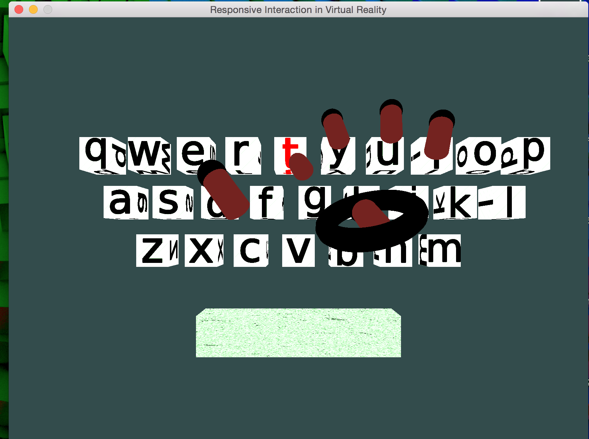
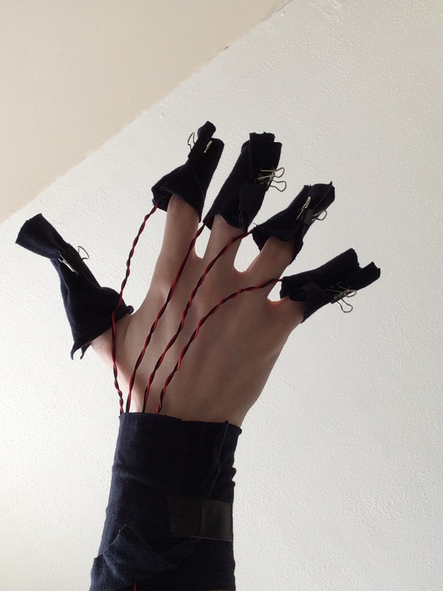
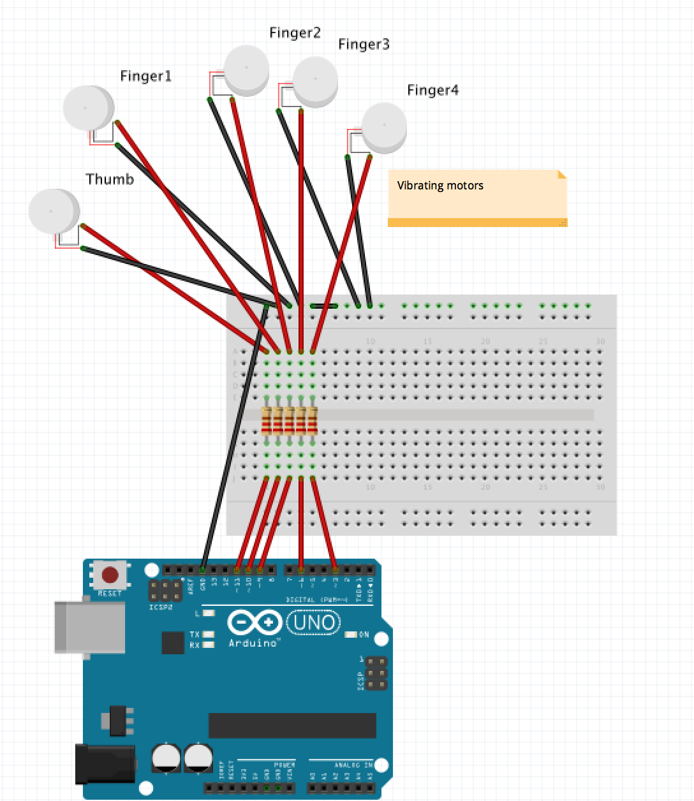
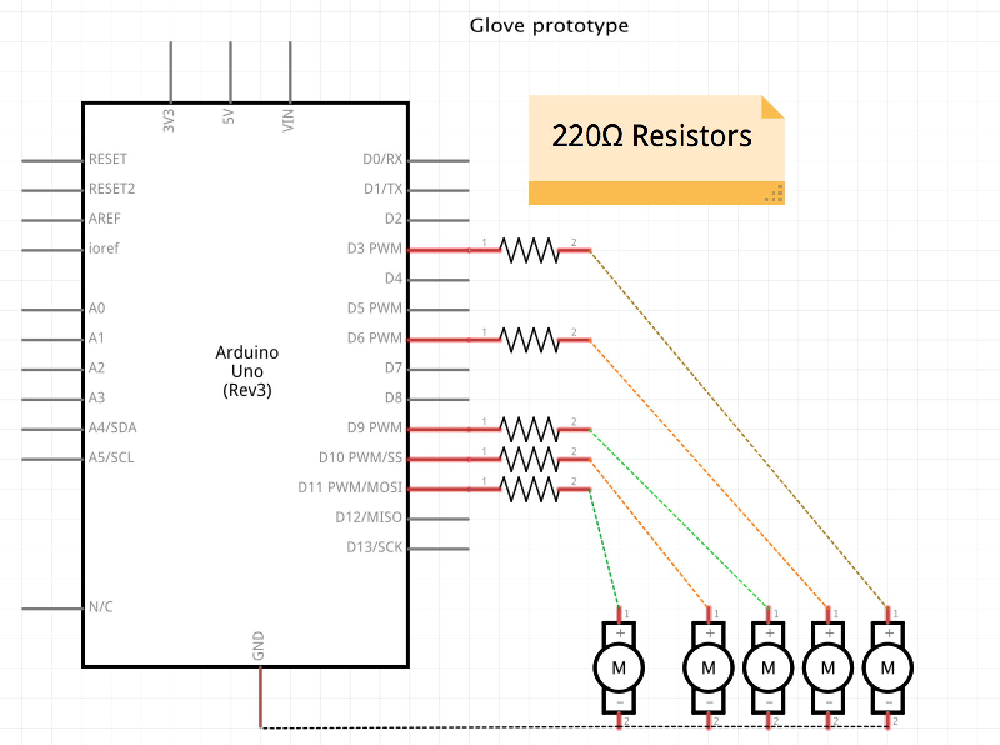

# RIVR 
_Responsive Interaction In Virtual Reality_ is a project for my dissertation at Cardiff University School of Computer Science &amp; Informatics, for this project I was awarded a 2:1

## Quick Summary

RIVR is an OpenGL render engine that renders a virtual keyboard, its a minimal haptic feedback experiment.
It uses a leap motion device to detect finger collision with a virtual keyboard, then outputs a signal to vibrating motors using arduino. 

The experiment was to compare gestures in virtual reality against a simulacrum of a keyboard, the idea being that familiarity with a keyboard in the physical domain would transfer into VR, my end result was that novel gesture techniques are needed. 

  

- Requirements: Leap Motion, Arduino, 5 small vibrating motors. 

The system is a basic render engine which renders keys and a hand model, the hand model maps with motions and gestures that are mapped by using the Leap Motion.

For this project I had to implement a graphics scene using modern OpenGL. I had to use OpenGL as my end goal was to implement the Oculus rift. The lenses of the rift are distorted to increase the FOV(field of view) and the easiest way to account for the distortion comes from using shaders. I had little experience with shaders and OpenGL until this point and I took the opportunity to learn.

## Arduino configuration

  

Here's a video I made, in this I've wired the arduino to LEDs for debugging (and its easier to see visually) 

https://user-images.githubusercontent.com/5430483/159656284-0a36c87d-3cce-4d50-9b4b-4a62e581e16e.mp4

